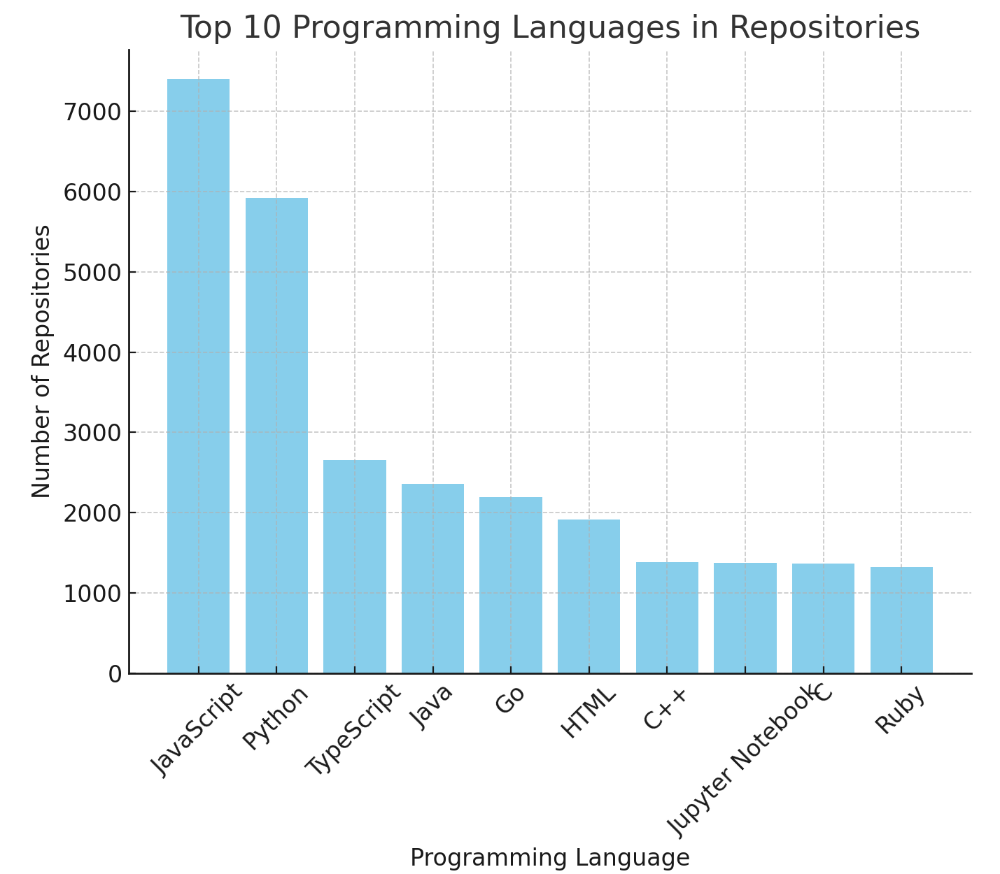

# TDS Project 1

Here’s a `README.md` for this GitHub scraping project:

---

# GitHub Users & Repositories Analysis: Singapore

---

### 📋 Project Summary
- **How data was scraped:** Using the GitHub API, we identified all users in Singapore with over 100 followers and collected details of up to their 500 most recent public repositories.
- **Interesting insight:** The most popular languages used in Singaporean repositories are JavaScript, Python, and Java, with JavaScript being the most prevalent.
- **Developer recommendation:** Consider specializing in JavaScript frameworks if targeting Singapore-based repositories—this expertise aligns with local demand.

---

## 📈 Project Overview

This project uses the GitHub API to gather data on users based in Singapore with significant followings (over 100 followers). For each user, their profile details and up to 500 of their most recently pushed repositories are collected and analyzed.

Files included in this repository:
- **`users.csv`** - Contains details about each user with over 100 followers.
- **`repositories.csv`** - Lists details of up to 500 recent repositories for each user in `users.csv`.

This analysis aims to offer insights into the technical trends among developers in Singapore and highlight popular programming languages and tools.

---

## 📂 Data Collection

Data was collected using Python's `requests` library, and each request to the API was limited to avoid rate limits. The `users.csv` and `repositories.csv` files were created with the following structure:

### `users.csv` Columns
- **login:** GitHub user ID.
- **name:** Full name of the user.
- **company:** Cleaned to ensure uppercase and strip leading `@`.
- **location:** City of the user (Singapore).
- **email:** User's email address (if available).
- **hireable:** Open to being hired (`true` or `false`).
- **bio:** User bio.
- **public_repos:** Number of public repositories.
- **followers:** Number of followers.
- **following:** Number of users they follow.
- **created_at:** GitHub account creation date.

### `repositories.csv` Columns
- **login:** GitHub user ID of the repository owner.
- **full_name:** Repository name.
- **created_at:** Repository creation date.
- **stargazers_count:** Number of stars.
- **watchers_count:** Number of watchers.
- **language:** Primary language used.
- **has_projects:** Whether projects are enabled (`true` or `false`).
- **has_wiki:** Whether the repository has a wiki (`true` or `false`).
- **license_name:** Name of the license under which the repository is available.

---

## 📊 Data Insights

Analyzing the gathered data, we discovered the following:
1. **Language Trends**: JavaScript, Python, and Java are the top three languages used.

2. **Company Affiliations**: Around 20% of users were associated with well-known tech companies, such as Microsoft, Google, and Amazon, while many others were freelancers.

3. **Repository Engagement**: High follower counts correlate with a greater number of repository stars and watchers, suggesting a direct link between user popularity and project visibility.

---

## 🔍 Insights & Recommendations

### Actionable Insights:
1. **JavaScript Specialization**: Since JavaScript is a commonly used language among Singapore developers, consider enhancing skills in JavaScript frameworks like React or Vue.js to align with the local tech landscape.
2. **Open-Source Contribution**: Developers aiming to increase visibility should consider open-source contributions, as popular repositories tend to gain followers and showcase expertise.
3. **Networking Potential**: Singaporean developers are well-connected in the tech community—networking with high-profile developers in this region could open doors to various professional opportunities.

---

## 🛠️ Usage Instructions

1. Clone this repository:
   ```bash
   git clone https://github.com/Abhinav3499/TDS_Project_1
   ```
2. View `users.csv` and `repositories.csv` to explore the user and repository data in Singapore.
3. Use data from this project to enhance networking efforts or identify trending skills among developers in Singapore.

---

## 📜 License

This project is available under the MIT License.